# State-Driven Architecture

Last updated: 2026-05-07

## Runtime Flow

```mermaid
flowchart LR
    Input["CardView / Button"]
    Screen["RoundScreen"]
    Store["GameStore.Dispatch(GameAction)"]
    RunReducer["RunReducer"]
    ChildReducers["RoundReducer / ShopReducer"]
    State["RunState snapshot"]
    Presenter["RoundPresenter"]
    ViewModel["RoundViewModel"]
    Render["RoundScreen render"]

    Input --> Screen
    Screen --> Store
    Store --> RunReducer
    RunReducer --> ChildReducers
    ChildReducers --> State
    State --> Presenter
    Presenter --> ViewModel
    ViewModel --> Render
```

## Responsibilities

- `RoundScreen` is the Unity scene bridge. It wires buttons/cards/offers to actions and renders view models.
- `GameStore` owns the current `RunState`, dispatches actions, and emits `StateChanged` only when the state reference changes.
- `GameAction` classes describe player/gameplay intent without mutating state.
- `RunReducer` is the root reducer. It coordinates money, phase changes, blind/shop flow, owned jokers, and shop refresh count.
- `RoundReducer` owns card selection, play, discard, sort, draw, score application, and round end state.
- `ShopReducer` owns offer selection, purchased offer flags, reroll state, and owned joker sell selection.
- `RunState`, `RoundState`, and `ShopState` are immutable snapshots. They expose constructors, factories, derived properties, and queries, not transition commands.
- `RoundPresenter` is pure projection from `RunState` to `RoundViewModel`.

## Action Surface

- Run lifecycle: `StartNewRunAction`, `ContinueRoundEndAction`
- Blind actions: `ToggleCardSelectionAction`, `PlaySelectedCardsAction`, `DiscardSelectedCardsAction`, `SortHandByRankAction`, `SortHandBySuitAction`
- Shop actions: `ContinueShopAction`, `SelectShopOfferAction`, `BuyShopOfferAction`, `RerollShopAction`
- Inventory sell actions: `SelectOwnedJokerAction`, `SellOwnedJokerAction`

Invalid actions preserve the same state reference. This keeps reducers predictable and lets `GameStore` avoid unnecessary UI refreshes.
