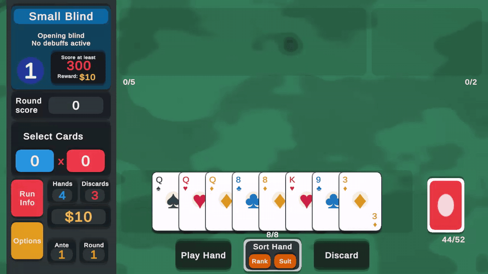
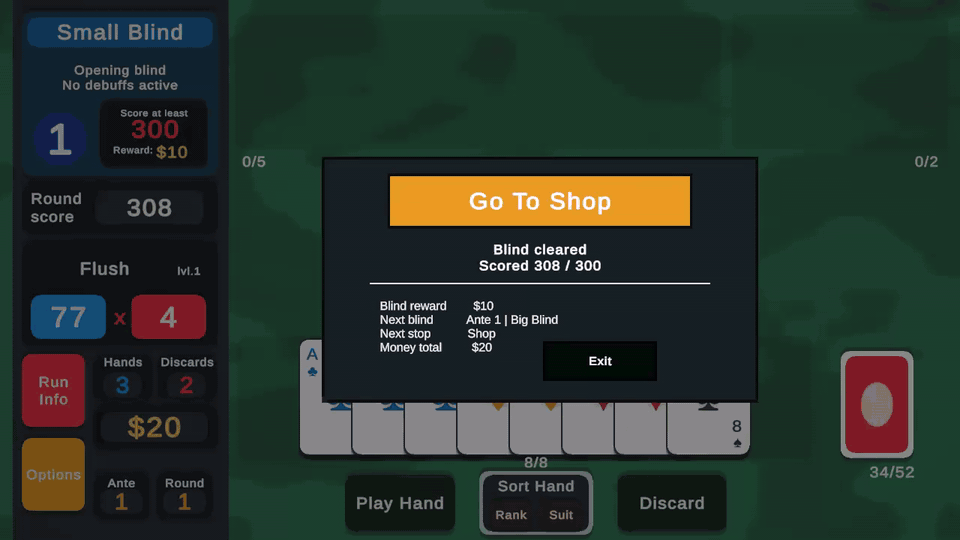
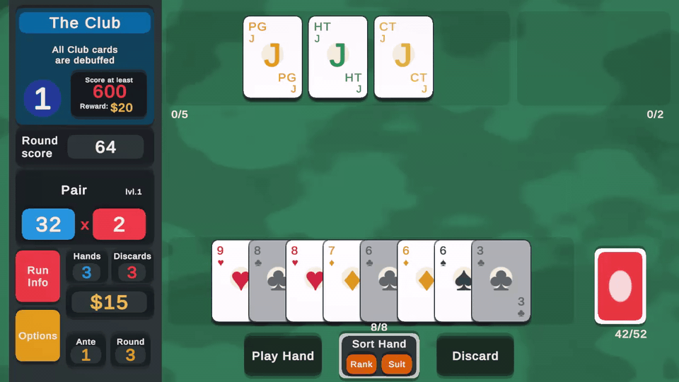

# Unity State-Driven Poker Roguelike Prototype

> A gameplay programming portfolio project focused on state-driven architecture, testable rules, card-game systems, and Unity UI presentation.
> Inspired by the core loop of poker roguelikes, built from scratch in Unity + C# as a professional portfolio piece.

## Overview

This repository is a systems-focused card game prototype created to demonstrate:

- clear gameplay state modeling
- reducer-based state transitions
- separation between game rules, presentation, and Unity scene wiring
- testable core gameplay logic
- deterministic deck, shop, joker, and scoring systems
- UI feedback through card movement, score popups, joker tooltips, and triggered modifier animations

This is not a commercial clone. It is an original portfolio study inspired by poker roguelike structure, using custom code, custom architecture, and original implementation decisions.

## Current Status

Status as of 2026-05-10: active development, playable blind/shop loop, joker modifier system, state-driven architecture, score presentation animations, joker hover tooltips, persistent in-round hand sorting, and Edit Mode coverage implemented.

Current playable slice:

- one playable scene: `Assets/Scenes/GameScene.unity`
- standard 52-card deck, shuffle, draw, play, discard, and selection cap
- poker hand evaluation and score calculation
- preview scoring while cards are selected
- scoring-card detection for hands, including kicker exclusion where appropriate
- Small Blind -> Big Blind -> The Club boss blind -> next ante progression
- blind rewards and money carry-over between blinds
- `Blind -> Shop -> Blind` transition flow
- structured shop overlay with 3 clickable offer slots, buy, reroll, sell, and continue actions
- deterministic random shop generation by run seed, shop refresh index, and joker rarity weights
- Common / Uncommon / Rare joker rarity labels in shop offers
- persistent owned jokers across blinds
- 5-slot joker inventory cap
- sell flow for owned jokers during shop
- joker score modifiers for additive Chips, additive Mult, xMult, money, extra hands, and extra discards
- owned jokers rendered in the upper playfield area
- joker tooltip prefab shown on hover with joker name and effect description
- triggered joker scoring animation with popup feedback
- score popup direction adjusted for upper-glass jokers so their feedback remains visible
- hand sorting by rank/suit persists during the current round and applies to newly drawn cards
- card-level Club debuff feedback during The Club
- round-end banner acts as the primary CTA: `Go To Shop` on victory, `New Run` on defeat
- Edit Mode tests for core systems, run flow, shop flow, presenter output, animation view models, and modifier behavior

Still missing:

- deeper balancing for joker costs, rarity weights, and power levels
- more boss blind variety beyond The Club
- final audio pass for score, boss, shop, and joker feedback
- final responsive layout polish for all UI containers
- manual Unity Test Runner verification as part of a release checklist

## Gameplay Gifs

### Playing hand system

### Shop system

### Bossing room


## Core Gameplay Concept

The project is built around a simplified poker roguelike loop:

1. Start a run.
2. Enter a blind.
3. Draw cards into hand.
4. Select and play up to 5 cards.
5. Evaluate the poker hand.
6. Calculate score from `Chips x Mult x XMult`.
7. Apply owned joker modifiers.
8. Compare score against the blind target.
9. Progress through blinds and antes.
10. Visit the shop between won blinds.
11. Buy, sell, and reroll jokers that modify future scoring.

The focus is not content volume. The focus is building a clean, inspectable, and expandable gameplay foundation that demonstrates production-minded systems work.

## Architecture Overview

The project follows a state-driven architecture:

```text
Player Input
-> RoundScreen
-> GameStore.Dispatch(GameAction)
-> RunReducer
-> RoundReducer / ShopReducer
-> RunState snapshot
-> RoundPresenter
-> RoundViewModel
-> UI Refresh / Animation Renderer
```

Actions are the only gameplay command API. `RunState`, `RoundState`, and `ShopState` are immutable snapshots with constructors, factories, derived properties, and queries. Reducers own state transitions, while `RoundScreen` acts as the Unity scene bridge and `RoundPresenter` converts state into UI text, button states, card view models, shop offer view models, and animation-ready data.

Important current files:

- `Assets/Scripts/Core/GameAction.cs`
- `Assets/Scripts/Core/GameStore.cs`
- `Assets/Scripts/Core/RunReducer.cs`
- `Assets/Scripts/Core/RoundReducer.cs`
- `Assets/Scripts/Core/ShopReducer.cs`
- `Assets/Scripts/Core/RunState.cs`
- `Assets/Scripts/Core/RoundState.cs`
- `Assets/Scripts/Core/BlindState.cs`
- `Assets/Scripts/Core/ShopState.cs`
- `Assets/Scripts/Core/ShopOfferState.cs`
- `Assets/Scripts/Core/HandSortMode.cs`
- `Assets/Scripts/Core/JokerCatalog.cs`
- `Assets/Scripts/Core/JokerState.cs`
- `Assets/Scripts/Core/RunModifierService.cs`
- `Assets/Scripts/Core/PokerHandEvaluator.cs`
- `Assets/Scripts/Core/ScoreCalculator.cs`
- `Assets/Scripts/Core/ScoringCardSelector.cs`
- `Assets/Scripts/Presenters/RoundPresenter.cs`
- `Assets/Scripts/MonoBehaviours/RoundScreen.cs`
- `Assets/Scripts/View/RoundViewModel.cs`
- `Assets/Scripts/View/CardView.cs`
- `Assets/Scripts/View/CardViewModel.cs`
- `Assets/Scripts/View/RoundBoardRenderer.cs`
- `Assets/Scripts/View/RoundAnimationController.cs`
- `Assets/Scripts/View/OfferView.cs`
- `Assets/Scripts/View/ScorePopupView.cs`
- `Assets/Scripts/View/JokerTooltipView.cs`
- `Assets/Scripts/Tests/EditMode`

## Actual Folder Structure

```text
Assets/
  Scenes/
    GameScene.unity
  Prefabs/
    CardViewPrefab.prefab
    Offer.prefab
    ScorePopUpPrefab.prefab
    JokerTooltipPrefab.prefab
  Scripts/
    Core/
      BlindState.cs
      DeckBuilder.cs
      DeckShuffler.cs
      GameAction.cs
      GameStore.cs
      HandBaseScore.cs
      HandSortMode.cs
      JokerCatalog.cs
      JokerState.cs
      PokerHandEvaluator.cs
      RoundReducer.cs
      RoundState.cs
      RunReducer.cs
      RunModifierService.cs
      RunState.cs
      ScoreCalculator.cs
      ScoringCardSelector.cs
      ShopReducer.cs
      ShopOfferState.cs
      ShopState.cs
    Data/
      CardData.cs
      JokerData.cs
    Debug/
      DebugCardFactory.cs
      DebugHandFactory.cs
      DebugHandScenario.cs
    Enums/
      BlindType.cs
      CardZone.cs
      JokerBonusType.cs
      JokerConditionType.cs
      JokerRarity.cs
      PokerHandType.cs
      Rank.cs
      RoundPhase.cs
      RunPhase.cs
      Suit.cs
    MonoBehaviours/
      RoundScreen.cs
    Presenters/
      RoundPresenter.cs
    Tests/
      EditMode/
    Utility/
    View/
      CardView.cs
      CardViewModel.cs
      CardViewPool.cs
      JokerTooltipView.cs
      OfferView.cs
      RoundAnimationController.cs
      RoundBoardRenderer.cs
      RoundViewModel.cs
      ScorePopupView.cs
      ShopOfferViewModel.cs
```

The architecture document in `Docs/STATE_DRIVEN_ARCHITECTURE.md` summarizes the current reducer/store pipeline.

## Systems Roadmap

### Milestone 1 - Single Blind Prototype

- [x] create 52-card deck
- [x] draw to hand size
- [x] select up to 5 cards
- [x] play selected cards
- [x] discard selected cards
- [x] detect poker hand
- [x] calculate score
- [x] win / lose a single blind
- [x] Edit Mode coverage for core rules

### Milestone 2 - Ante Flow

- [x] Small Blind
- [x] Big Blind
- [x] The Club boss blind identity and progression
- [x] blind reward
- [x] ante progression
- [x] money carry-over
- [x] `Blind -> Shop -> Blind` transition path
- [x] Clubs debuffed during The Club

### Milestone 3 - Shop

- [x] money system
- [x] enter / leave shop flow
- [x] shop state model
- [x] deterministic random offer generation
- [x] offer selection
- [x] buy clicked offer
- [x] reroll offers
- [x] persistent owned jokers across the run
- [x] structured 3-slot shop offer UI
- [x] sell flow
- [x] randomized shop generation
- [x] Common / Uncommon / Rare rarity model
- [x] deterministic run seed for shop generation
- [x] full-inventory purchase blocking

### Milestone 4 - Joker / Modifier System

- [x] `JokerData` data model
- [x] `JokerCatalog`
- [x] `JokerState` run ownership
- [x] additive Chips bonuses
- [x] additive Mult bonuses
- [x] hand-type conditions
- [x] rank/suit/face-card conditions
- [x] preview and real score modifier application
- [x] owned joker rendering
- [x] basic rarity model
- [x] xMult effects
- [x] economy effects
- [x] extra hand / discard effects
- [x] triggered joker feedback
- [x] 18-joker rarity pool
- [x] triggered joker animation during score presentation
- [x] joker tooltip with name and effect description

### Milestone 5 - Portfolio Polish

- [x] custom HUD pass
- [x] generated placeholder UI art
- [x] screenshot references
- [x] architecture diagram
- [x] card selection animation
- [x] play-hand movement animation
- [x] discard animation
- [x] score calculation animation
- [x] score popup prefab
- [x] joker trigger animation
- [x] round-end banner as primary CTA
- [x] persistent in-round hand sorting
- [x] current README pass for recruiter-facing project state
- [x] gameplay GIF
- [x] documented manual release test pass

## Current Gameplay Systems

### Cards and Deck

Implemented:

- standard 52-card deck generation
- shuffle
- draw
- discard selected cards and redraw
- play selected cards and redraw
- selected card cap of 5
- sort hand by rank
- sort hand by suit
- preserve the last selected sort mode during the current round when new cards are drawn

### Poker Hand Evaluation

Implemented:

- High Card
- Pair
- Two Pair
- Three of a Kind
- Straight
- Ace-low Straight
- Flush
- Full House
- Four of a Kind
- Straight Flush

Current rule note:

- `Flush` requires exactly 5 played cards of the same suit.
- `Straight Flush` depends on the same flush validation.
- scoring-card selection is separated from hand detection so kickers can be ignored where appropriate.

### Scoring

Implemented:

- base hand score table
- scoring card selection
- final score from `Chips x Mult x XMult`
- round score accumulation
- preview score while selecting cards
- joker modifier application in preview and final play scoring
- animated score presentation for played cards
- score popup prefab with reusable pooling
- animated Chips, Mult, and round score counters
- triggered joker contribution tracking
- triggered joker popup feedback

Current scoring rules:

- for `High Card`, only the highest card scores
- for `Pair`, `Two Pair`, `Three of a Kind`, and `Four of a Kind`, only the matching cards score
- for `Straight`, `Flush`, `Full House`, and `Straight Flush`, all hand cards score
- The Club boss blind removes chip value from scoring Club cards
- xMult applies after additive Chips and additive Mult

### Shop and Jokers

Implemented:

- deterministic joker catalog with 18 jokers
- Common / Uncommon / Rare rarity metadata
- random weighted shop generation with deterministic run seed
- shop state with selected offer index, reroll count, and reroll cost
- structured 3-slot offer view model and `Offer.prefab` UI
- click an offer slot to select it
- buy a clicked offer directly through `BuyShopOfferAction`
- block bought/unaffordable offers and full-inventory purchases
- reroll offers for money, starting at `$5` and increasing by `$1`
- refresh offers on every shop phase
- exclude already owned jokers while enough unowned jokers remain
- mark fallback owned offers as bought when the pool is exhausted
- sell owned jokers during shop for half cost rounded down, minimum `$1`
- cap owned jokers at 5 slots
- persist owned jokers in `RunState`
- render owned jokers in the upper playfield area
- show joker tooltip on hover from the owned joker `CardView`
- apply additive Chips/Mult, xMult, money, extra hand, and extra discard effects through `RunModifierService` and `RunState`
- animate jokers when their effect triggers during scoring

Next shop-related slices:

- tune rarity weights, costs, and power
- add richer content and polish beyond the current Milestone 4 pool
- improve sell/inventory presentation polish
- add more boss blind and joker interaction variety

## Testing Strategy

The project keeps core rules testable without relying on scene setup or UI.

Current Edit Mode test areas:

- `GameStore`
- `RunReducer`
- `RoundReducer`
- `PokerHandEvaluator`
- `ScoreCalculator`
- `ScoringCardSelector`
- `BlindState`
- `RoundState`
- `RunState`
- `RunModifierService`
- `RoundPresenter`
- shop presenter output
- boss blind score behavior
- animation-facing view model data

Current automated coverage includes 112 Edit Mode tests.

Local verification:

- `dotnet build StateDrivenPokerRoguelike.EditModeTests.csproj --no-restore`

Manual validation still needed in Unity:

- win Small Blind, enter shop, confirm 3 randomized rarity-labeled offers
- buy a joker, see money decrease and joker render in the upper playfield area
- hover a bought joker and confirm the tooltip shows its name and effect
- continue to Big Blind and confirm the bought joker affects preview and final score
- play a hand that triggers a joker and confirm the joker animates with a popup
- reroll offers and confirm money decreases by `$5`, offers refresh, and next reroll costs `$6`
- enter a later shop and confirm fresh offers load
- sell a joker from `UpperGlass`, confirm money increases and the effect is removed
- attempt purchase without enough money and confirm the action is blocked
- attempt duplicate purchase and confirm no duplicate joker is added
- fill all 5 joker slots, confirm full inventory blocks buying, then sell one joker and buy again
- confirm xMult, money, extra hand, and extra discard jokers apply in their expected timing
- during The Club, confirm Club cards are visually debuffed and do not add card chips
- sort by rank or suit, then play/discard cards and confirm newly drawn cards keep the selected sort mode
- complete a round and confirm the banner CTA goes to shop on victory or starts a new run on defeat

Batchmode note:

- Automated Edit Mode coverage is maintained through the generated C# test project.
- Unity Test Runner should still be used for a final manual release pass before tagging a portfolio build.

## Recommended Next Features

Priority order:

1. Record final gameplay GIF and capture recruiter-facing screenshots.
2. Run a full Unity Test Runner Edit Mode pass and document the result.
3. Tune rarity weights, costs, and power after playtesting the 18-joker pool.
4. Polish boss blind animation/audio feedback for `The Club`.
5. Add more joker and boss blind variety after the current portfolio slice is stable.
6. Create a portfolio release tag with changelog and playable build notes.

## Technical Stack

- Engine: Unity 6000.3.12f1
- Language: C#
- UI: Unity UI / UGUI
- Text rendering: TextMesh Pro
- Animation/tweening: DOTween
- Rendering setup: Universal Render Pipeline
- Testing: Unity Test Framework / NUnit
- Pattern focus: state-driven gameplay architecture
- Target purpose: portfolio / study / gameplay systems practice

## Notes on Inspiration and Originality

This project is inspired by the structural loop of poker roguelike design. It does not aim to reproduce commercial content, original art, branding, or proprietary assets.

The goal is to demonstrate game flow, scoring systems, state architecture, modifier interactions, Unity UI integration, animation feedback, and gameplay programming patterns.

## Contact

This repository is part of my gameplay programming portfolio.
